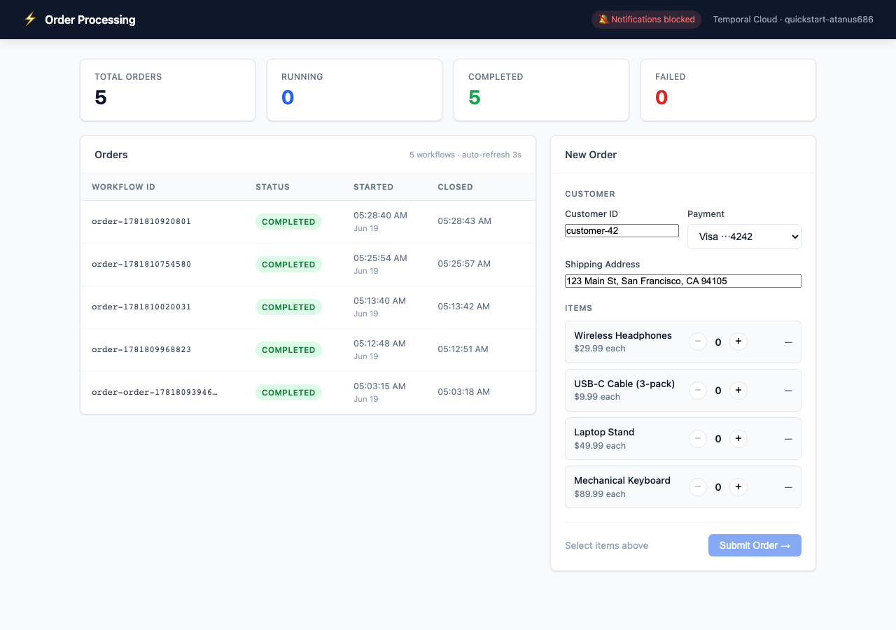
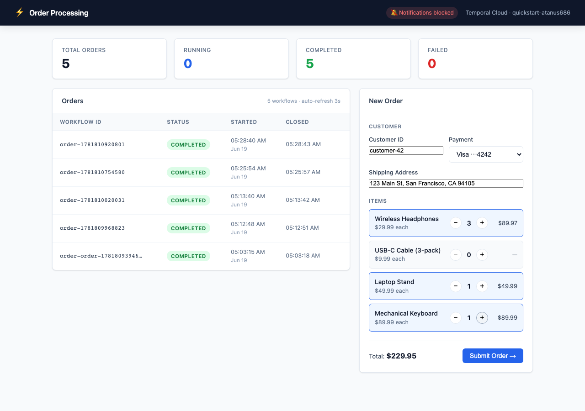
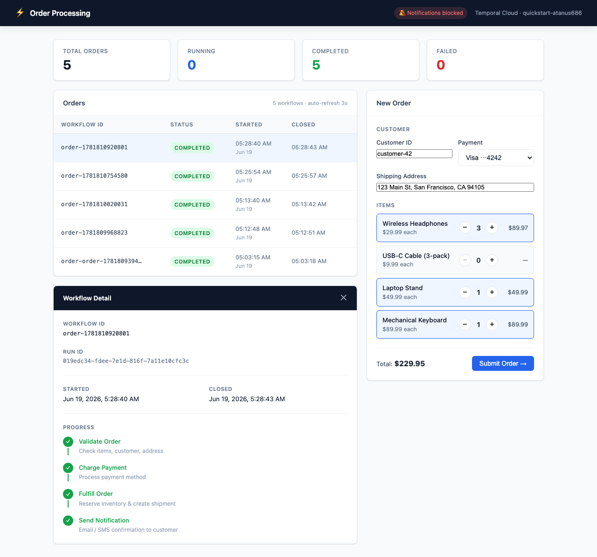
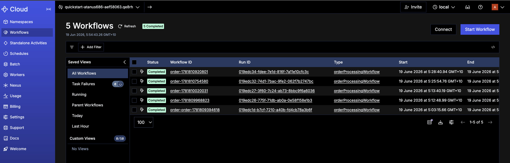

# Temporal Order Processing

A TypeScript application demonstrating Temporal Cloud workflows with a React dashboard. Implements an order processing pipeline (validate → charge → fulfill → notify) with saga-pattern compensation on failure.

## Screenshots

**Dashboard — live order stats and status table**


**Order form — product picker with quantity controls and running total**


**Workflow detail — progress timeline for a completed order**


**Temporal Cloud console — all 5 workflows visible in the namespace**


## Architecture

```
┌─────────────────────────────────────────────────────┐
│                  React Dashboard                    │
│          (Vite · localhost:5173)                    │
└───────────────────┬─────────────────────────────────┘
                    │ HTTP
┌───────────────────▼─────────────────────────────────┐
│               Express API Server                    │
│          (ts-node · localhost:3001)                 │
│  POST /api/orders   · GET /api/orders               │
│  GET  /api/orders/:id · DELETE /api/orders/:id      │
└───────────────────┬─────────────────────────────────┘
                    │ gRPC (Temporal SDK)
┌───────────────────▼─────────────────────────────────┐
│             Temporal Cloud                          │
│    namespace: quickstart-atanus686-aef58063         │
│    task queue: order-processing                     │
└───────────────────┬─────────────────────────────────┘
                    │
┌───────────────────▼─────────────────────────────────┐
│                Temporal Worker                      │
│          (ts-node · local process)                  │
│  Workflow: orderProcessingWorkflow                  │
│  Activities: validate → charge → fulfill → notify   │
└─────────────────────────────────────────────────────┘
```

## Workflow

```
orderProcessingWorkflow
  ├── validateOrder      — checks items, customer ID, address
  ├── chargePayment      — processes payment method
  │     └── on downstream failure → refundPayment (compensation)
  ├── fulfillOrder       — reserves inventory, creates shipment
  │     └── on failure  → cancelFulfillment (compensation)
  └── sendNotification   — fires browser push notification
```

## Prerequisites

- Node.js 18+
- A [Temporal Cloud](https://cloud.temporal.io) account with a namespace
- A Temporal Cloud API key

## Setup

```sh
# 1. Install root dependencies
npm install

# 2. Install UI dependencies
cd ui && npm install && cd ..

# 3. Configure environment
cp .env.example .env
# Edit .env and set TEMPORAL_API_KEY, TEMPORAL_NAMESPACE, TEMPORAL_ADDRESS
```

`.env` fields:

| Variable | Description |
|---|---|
| `TEMPORAL_API_KEY` | API key from Temporal Cloud console |
| `TEMPORAL_NAMESPACE` | Your namespace (e.g. `myapp-abc123.a1b2c`) |
| `TEMPORAL_ADDRESS` | gRPC endpoint (e.g. `myapp-abc123.a1b2c.tmprl.cloud:7233`) |
| `TEMPORAL_TASK_QUEUE` | Task queue name (default: `order-processing`) |

## Running

Open three terminals:

```sh
# Terminal 1 — Temporal worker
npm run worker

# Terminal 2 — Express API server
npm run server

# Terminal 3 — React dashboard
cd ui && npm run dev
```

Open **http://localhost:5173**.

## Dashboard features

- **Submit orders** — pick products with +/− quantity controls, choose payment method and shipping address
- **Live status table** — auto-refreshes every 3 s; animated pulse on running workflows
- **Workflow detail panel** — click any row to see IDs, timestamps, and a 4-step progress timeline
- **Browser push notifications** — OS-level notification when an order completes or fails
- **Cancel** — cancel any running workflow from the table

## Project structure

```
├── src/
│   ├── activities.ts   — Temporal activities (validate, charge, fulfill, notify)
│   ├── workflows.ts    — orderProcessingWorkflow with saga compensation
│   ├── worker.ts       — Temporal worker (connects to Cloud, registers workflow + activities)
│   ├── server.ts       — Express REST API (wraps Temporal client)
│   └── client.ts       — One-shot CLI to start a workflow from the terminal
└── ui/
    └── src/
        ├── App.tsx
        ├── components/
        │   ├── OrderForm.tsx    — Product picker + order submission
        │   ├── OrderList.tsx    — Live order status table
        │   └── OrderDetail.tsx  — Workflow detail + progress steps
        └── hooks/
            └── useOrderNotifications.ts  — Browser push notification hook
```

## One-shot CLI

To start a workflow without the UI:

```sh
npm run start-workflow
```
